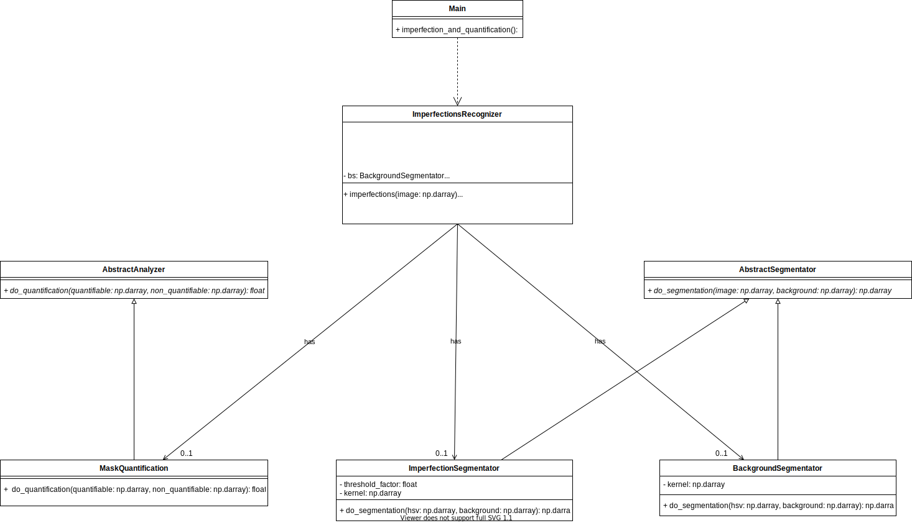

# AIVA_2021_AJ

This repository contains the practice developed for MUVA's Industrial and Commercial Applications course. In it, we are required to develop a machine vision system following the best practices for its development.

Some of these practices are:

- Learn how to talk to the customer through meetings.
- Use contractual documentation to specify the objectives of the project to be carried out.
- To make clarifying diagrams for communication with the client and among the development team.
- Perform unit test based programming, with the objective of improving development time.
- Learn how to use tools that facilitate this type of tasks.

## Project

The subject of the project is the detection of imperfections on the surface of pieces of wood, for a company dedicated to this industry.

## Environment

A camera system is available that captures, at the instant a piece of wood passes through, the image of its surface. These pieces move on a black conveyor belt and are uniformly illuminated.

## Dataset provided by customer

This section shows some examples of images provided by the client.

- [Without imperfections](./docs/images/without_imperfections.png)

  

- [With knots and cracks](./docs/images/with_knots_cracks.png)

  

## Kind of imperfections

The imperfections present in the wood pieces have a dark coloration due to knots or cracks.
- [Knots](./docs/images/knots.jpeg), is defined as the area of woody tissue resulting from the trace left by the development of a branch.

  

- [Cracks](./docs/images/cracks.jpeg), is the separation of the fibers (slit or cleft) in the longitudinal direction.

  

## Links of interest
- [DSR documentation](./docs/files/DSR.pdf)
- [Client scheme](./docs/images/ClientScheme.png)

  

- [Use cases](./docs/images/usecases.svg)

  

- [UML scheme](./docs/images/UML.svg)

  

## References

- [Wood imperfections](http://web.archive.org/web/20210318123151/https://normadera.tknika.eus/es/content/medici%C3%B3n-de-singularidades-en-madera-estructural.html)
- [Image used in ClientScheme](https://images.vexels.com/media/users/3/145736/isolated/preview/8e99b5ecf870581da80ce137827eeee4-dibujos-animados-de-la-m-aacute-quina-de-ideas-by-vexels.png)
