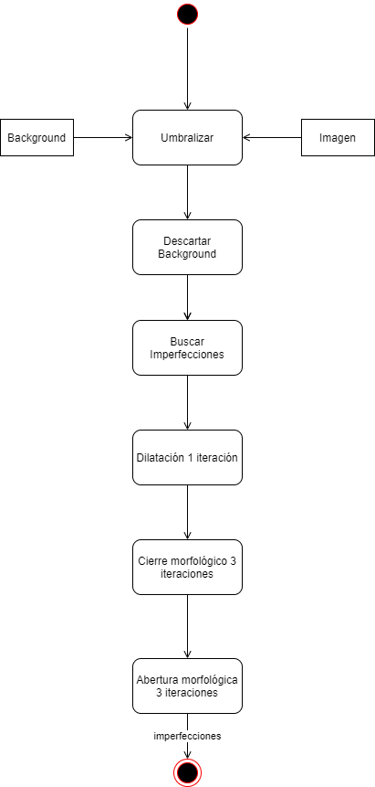
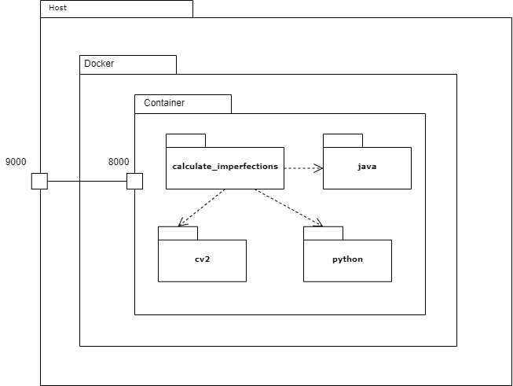
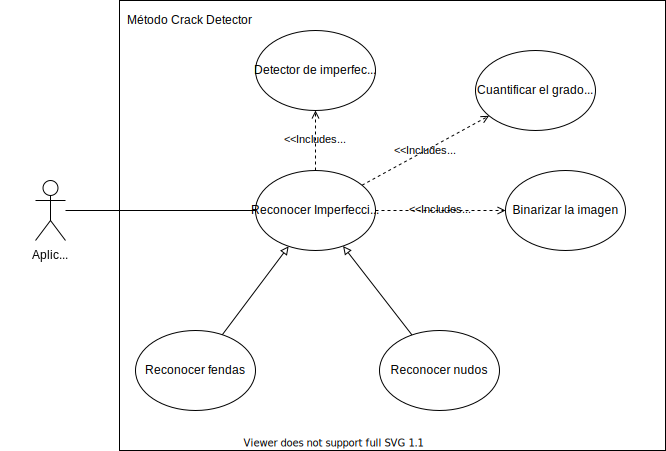

# AIVA_2021_AJ

This repository contains the practice developed for MUVA's Industrial and Commercial Applications course. In it, we are required to develop a machine vision system following the best practices for its development.

Some of these practices are:

- Learn how to talk to the customer through meetings.
- Use contractual documentation to specify the objectives of the project to be carried out.
- To make clarifying diagrams for communication with the client and among the development team.
- Perform unit test based programming, with the objective of improving development time.
- Learn how to use tools that facilitate this type of tasks.

## Project

The subject of the project is the detection of imperfections on the surface of pieces of wood, for a company dedicated to this industry.

Index:
1. Environment
2. Dataset providad by customer
3. Kind of imperfections
4. Solution implemented
5. Metrics
6. Deployment with Docker and Java
7. Links of interest
8. References

## 1. Environment

A camera system is available that captures, at the instant a piece of wood passes through, the image of its surface. These pieces move on a black conveyor belt and are uniformly illuminated.

## 2. Dataset provided by customer

This section shows some examples of images provided by the client.

- [Without imperfections](./docs/images/without_imperfections.png)

  

- [With knots and cracks](./docs/images/with_knots_cracks.png)

  

## 3. Kind of imperfections

The imperfections present in the wood pieces have a dark coloration due to knots or cracks.
- [Knots](./docs/images/knots.jpeg), is defined as the area of woody tissue resulting from the trace left by the development of a branch.

  

- [Cracks](./docs/images/cracks.jpeg), is the separation of the fibers (slit or cleft) in the longitudinal direction.

  

## 4. Solution implemented

The following images show some examples of very good and not so good results. The problem that has been detected is that a new type of defect has appeared in the wood that was not previously detected. This defect presents a lot of roughness on the surface and alters the brightness levels, modifying in an unstable way the threshold to be used. In future works we will explain some solutions for this problem, but it is important to emphasize that this is a first prototype for the solution of the problem.

The image below shows the sequence diagram of the implemented solution, where the main method uses the classes shown in the [UML diagram](./docs/images/UML_amp.svg). And this in turn is divided into two other activity diagrams that show the operation of ImperfectionSegmentator and BackgroundSegmentator.

- [Solution Sequence Diagram](./docs/images/SequenceDiagram.png)

  

- [Imperfection Segmentator Activity Diagram](./docs/images/UML_Imperfection_activity.png)

  

- [Background Segmentator Activity Diagram](./docs/images/UML_Background_activity.png)

  

In summary, image thresholding and morphological operations are being applied to improve the results obtained. Thus obtaining a segmentation of the defects that is subsequently quantified to obtain a numerical value. The main advantage is that no neural networks are used, it is fast and easily adaptable to other situations.

## 5. Metrics

## 6. Deployment with Docker and Java

For the deployment of this method, a Docker image has been created with all the necessary dependencies for its use. In the system document you can find a [tutorial](./docs/files/Documento_del_Sistema.pdf) developed for our customer in which the whole process for its use is explained. 

In the deployment diagram you can see how the Docker image (hosted in Docker Hub docker "pull andrestena/image_aiva_2021_aj:latest") generates a container that has the OpenCV, Python and Java dependencies needed to easily test the operation of the developed algorithm.

- [Deployment Diagram](./docs/images/UML_app_despliegue.png)

  

Our customer needs that this method can be executed in Java, so we have developed an example of use from this language. So we have modified the sequence diagram of the program to reflect these changes (Java calls Python's "calculate_imperfections" method and passes it the image directory as an argument).

- [Final Sequence Diagram](./docs/images/UML_app_java.png)

  

Finally, the activity diagram for using the generated Docker image is shown. Where you can see that the image is located in Docker Hub, then a container containing all the dependencies is generated, executed and finally, linked to the execution. 

- [Docker Activity Diagram](./docs/images/UML_docker_despliegue.png)

  

## 7. Links of interest
- [DSR documentation](./docs/files/DSR.pdf)
- [Design documentation](./docs/files/Documento_de_diseno.pdf)
- [System documentation](./docs/files/Documento_del_Sistema.pdf)
- [Client scheme](./docs/images/ClientScheme.png)

  

- [Use cases](./docs/images/usecases.svg)

  

- [UML scheme](./docs/images/UML.svg)

  

## 8. References

- [Wood imperfections](http://web.archive.org/web/20210318123151/https://normadera.tknika.eus/es/content/medici%C3%B3n-de-singularidades-en-madera-estructural.html)
- [Image used in ClientScheme](https://images.vexels.com/media/users/3/145736/isolated/preview/8e99b5ecf870581da80ce137827eeee4-dibujos-animados-de-la-m-aacute-quina-de-ideas-by-vexels.png)
